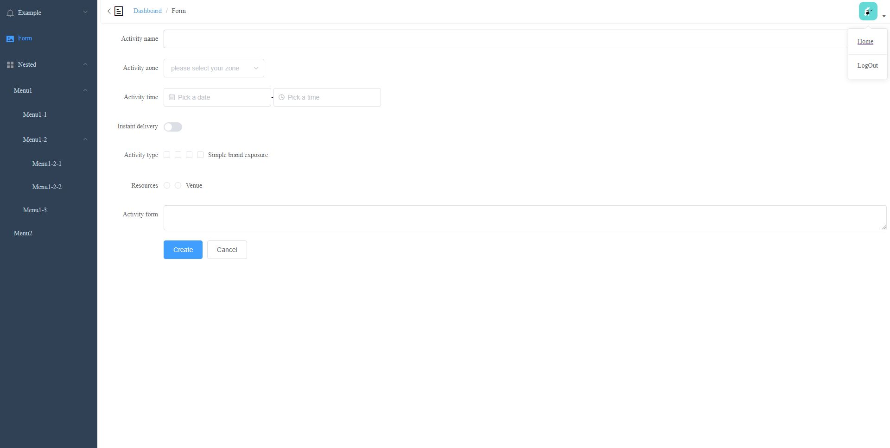

## Vue Element UI template

---

It is sample template using element UI frame work.

## UI reference link

---

http://element.eleme.io

### Screenshot

---

## Technologies

---

A list of technologies used within the project:

- [Vue](https://v3.vuejs.org/): Version 3
- [vue Router](https://unpkg.com/vue-router@4): Version 4
- [Element UI](https://element-plus.org/#/en-US): Version 3

## Notes

---

- Before running this app in your local make sure you have the web server installed in your machine.
- Since, we have used cdn's to load the required libraries use a server like an apache to run the app.
- As of now, we are used downloaded CDN files from the assets folder and As well, commented CDN direct links in the index.html file for your optional way.
